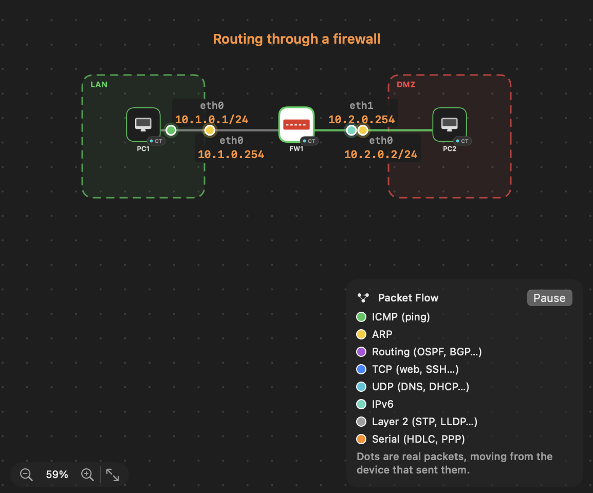
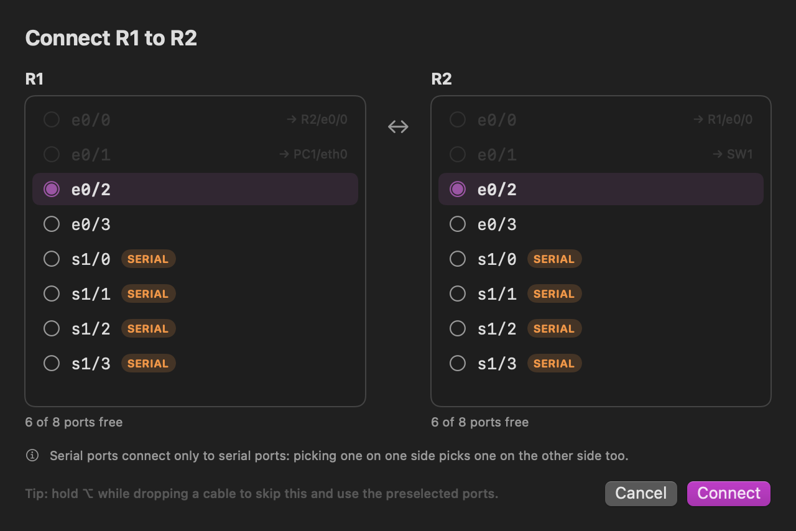

# Patchyard

**Network labs on your Mac, with real devices.**

[](https://github.com/Jalwan0x/Patchyard/releases/latest)


[](https://buymeacoffee.com/jalwan)

Patchyard is a free network lab app for Apple Silicon Macs. It runs real
routers, switches, firewalls and Linux machines as virtual machines and
containers, connects them with real virtual Ethernet, and lets you watch the
packets move. Think EVE-NG or GNS3, but a native Mac app that sets itself up,
or Cisco Packet Tracer, but with the real operating systems instead of a
simulation.

Use it to study for CCNA, CCNP or security certifications, to test a
FortiGate or Cisco configuration before you touch production, or to build a
homelab without spare hardware.



## Download

Get the latest version from the
[Releases page](https://github.com/Jalwan0x/Patchyard/releases/latest), unzip
it and move **Patchyard** to Applications. The step-by-step
[guide](https://github.com/Jalwan0x/Patchyard/releases/latest) is attached to
each release.

The app is not signed by Apple yet, so the first time macOS shows "Patchyard
Not Opened". Click **Done**, open **System Settings → Privacy & Security**,
scroll to **Security** and click **Open Anyway**. You only do this once.

To check the download, compare its checksum with the `.sha256` file on the
release page: `shasum -a 256 Patchyard-*.zip`.

Then click **Set Up Lab Engine**: it downloads a small Linux system and
prepares it, which takes about two minutes.

## What's new in 2.0.4

- **Cisco vIOS:** the import dialog reads the packed `.tgz`, sets x86_64, and shows the port names for the number of interfaces you pick (router Gi0/0 to Gi0/9; L2 and L3 switches Gi0/0 to Gi0/15).

## What's new in 2.0.3

- **Import:** Cisco vIOS and other packed VM images (`.tgz` or `.tar.gz`) import directly. The disk is taken out of the archive for you.
- A file that is only an archive, with no disk inside, is refused with a clear message.

## What's new in 2.0.2

- Uses much less battery: the app checks the lab engine less often when it is in the background, and only redraws what changed.
- Packet Flow stops animating once the last packet has arrived.
- An idle lab engine stays idle.

## What's new in 2.0.1

- Importing an ISO such as TinyCore turns on a graphical screen, so **Display** works right away.
- Plain names for the Display setting, and a hint when an image has no screen.
- **Start Lab Engine** button when the engine is not running.

## What's new in 2.0.0

- **Editing:** undo and redo for every change (⌘Z, ⇧⌘Z), and copy, cut, paste and duplicate for devices, cables, labels and boxes (⌘C, ⌘X, ⌘V, ⌘D), including between labs.
- **Cables:** delay, jitter, loss and bandwidth on any cable, applied live. Unplug a cable without deleting it.
- **Import:** open EVE-NG (`.unl`) and GNS3 (`.gns3`) labs from File → Import Lab…. Devices are matched to the images you have installed.
- **Configs:** save a Cisco IOS or FortiGate config into the lab, and have it typed back in when the device starts on a fresh disk.

## Your first lab in five minutes

1. **Images → Starter images → Alpine Linux PC**, install.
2. **New Lab**, then click **+** next to Alpine Linux PC twice.
3. Click **Cable**, click one PC, then the other, press Return.
4. **Start All**, then double-click each PC to open its terminal and give it
   an address: `ip addr add 10.0.0.1/24 dev eth0` on one,
   `ip addr add 10.0.0.2/24 dev eth0` on the other.
5. `ping 10.0.0.2`. Turn on **Packet Flow** to watch the packets travel.

## Opening a FortiGate's web interface

Click the FortiGate. The top of the right-hand panel, **Open from your Mac**,
shows the exact address to use, for example `https://localhost:8443`, with
**Open** and **Copy** buttons, and the SSH command. Always use that
`localhost` address from your Mac. The FortiGate's own `10.x` address is for
other devices inside the lab. port1 must be cabled to an **Internet (NAT)**
cloud; if it is not, the panel offers a button that does it. The browser's
certificate warning is normal for a firewall: continue anyway.

## What you can do

**Build a topology by hand.** Add devices from the palette, then click
**Cable**, click two devices, and pick the ports in the Connect window. Free
ports are listed with the usual choice preselected; taken ports show where
they are plugged in.



**Run real devices.**

- ARM64 virtual machines run at native speed on M3 and later (KVM). x86 images
  run under emulation.
- Lightweight Linux containers boot in about a second.
- Ubuntu and Debian cloud images, with a login set for you.
- Any Docker image as a device, for example FRRouting as a router.

**Bring the images you already use.**

- **FortiGate** (ARM64 and x86): template with port names, management access
  from your Mac at `https://localhost:8443`, and licence UUID support.
- **Cisco IOL / IOU**: routers and Layer 2 switches, with Ethernet and serial
  ports (HDLC, PPP, Frame Relay).
- **Cisco Dynamips**: classic 7200, 3700, 3600 and 2600 routers.
- **Palo Alto, Juniper vSRX, MikroTik, VyOS, Windows** templates, and any
  qcow2, vmdk, vhdx or ISO image.

Patchyard does not include vendor images. You import the ones you are
licensed to use. FortiGate has been tested with Fortinet's own images. Cisco
IOL and Dynamips were tested with stand-in images, and the other templates
have not been tried with the vendors' images yet. If one does not boot,
please open an issue.

**See what is happening on the wire.**

- **Packet Flow** draws each packet as a coloured dot travelling along its
  cable, and lists it in plain words: `PC1 → FW1 · ICMP echo request`. It
  understands ARP, ping, OSPF, BGP, EIGRP, DNS, DHCP, web traffic, STP, LLDP,
  VLAN tags and serial links.
- **Packet capture** on any cable, saved as PCAP or opened live in Wireshark.

**Make the lab easy to read.** Add titles and notes, draw boxes around zones
such as LAN and DMZ, write the IP address next to each port, and use your own
picture for a device.

**Networking that behaves like the real thing.** Point-to-point cables,
switches with VLAN access and trunk ports, and an Internet cloud that gives
devices DHCP and internet access.

**Everything else you expect.** Consoles for every device, a graphical screen
for desktops and installers, snapshots, lab import and export as plain JSON,
and CPU and memory meters.

## Requirements

- A Mac with Apple Silicon (M1, M2, M3 or M4). M3 and later run ARM64 virtual
  machines natively; M1 and M2 emulate them, which is slower. Containers are
  fast on all of them.
- macOS 15 or later.
- About 4 GB of free disk space, plus your images.
- Docker Desktop, OrbStack or Colima, only if you want to import Docker images.

## What it uses on your Mac

- **CPU and memory:** the lab engine may use all but two CPU cores and up to
  half your RAM (at most 12 GB). Memory is only taken as devices need it.
  Change both in **Settings**.
- **Disk:** the engine's disk grows as you use it, up to 64 GB. Your images
  come on top of that.
- **Network:** Patchyard downloads only from official sources: Debian (the
  engine and its packages), Ubuntu and Alpine (starter images), and GNS3's
  GitHub (Dynamips, only if you use it). It has no telemetry or analytics.

## Uninstall

Stop the lab engine (the stop button next to **Lab engine** at the bottom of
the sidebar), quit Patchyard, then delete the app and its data:

```
rm -rf /Applications/Patchyard.app "$HOME/Library/Application Support/Patchyard"
```

The second path holds your labs and images, so copy anything you want to keep
first.

## Questions

**Is it free?** Yes, completely.

**Is the source code available?** Not at the moment. The app is free to use,
and the download page is where releases and updates are published.

**Does it work on Intel Macs?** No. Patchyard needs Apple Silicon.

**Can I run x86 images like Cisco Catalyst 8000V or Palo Alto?** Yes, under
emulation. Light images work well. Heavy ones are slow, so give the lab
engine enough memory in Settings.

**Where are my labs stored?** In `~/Library/Application Support/Patchyard`.
Deleting the app keeps them.

**Import from Docker does not work.** Install and start Docker Desktop,
OrbStack or Colima, or use the Ubuntu Server starter image, which needs no
Docker.

**A FortiGate says "License invalid".** The image has no licence yet. Connect
port1 to an Internet cloud and request a trial in the FortiGate interface, or
upload your licence file.

**Setting up the lab engine fails.** The message says why. If it mentions
the internet, connect and click **Set Up Lab Engine** again: the download
continues where it stopped. The first start of the engine also downloads QEMU,
which can take several minutes on a slow connection.

**I imported an ISO and only see a text console.** Stop the device, open
**Images**, select the image, click **Edit Template** and set **Display** to
**Graphical screen**. Then use **Display** on the running device.

**Something else does not work.** Please
[open an issue](https://github.com/Jalwan0x/Patchyard/issues) with what you did,
what you expected and what happened. The device console and the Log tab
usually show the cause.

## Support

Patchyard is free and has no ads. If it helps you study or work, you can
[buy me a coffee](https://buymeacoffee.com/jalwan). Thank you.

[](https://buymeacoffee.com/jalwan)
